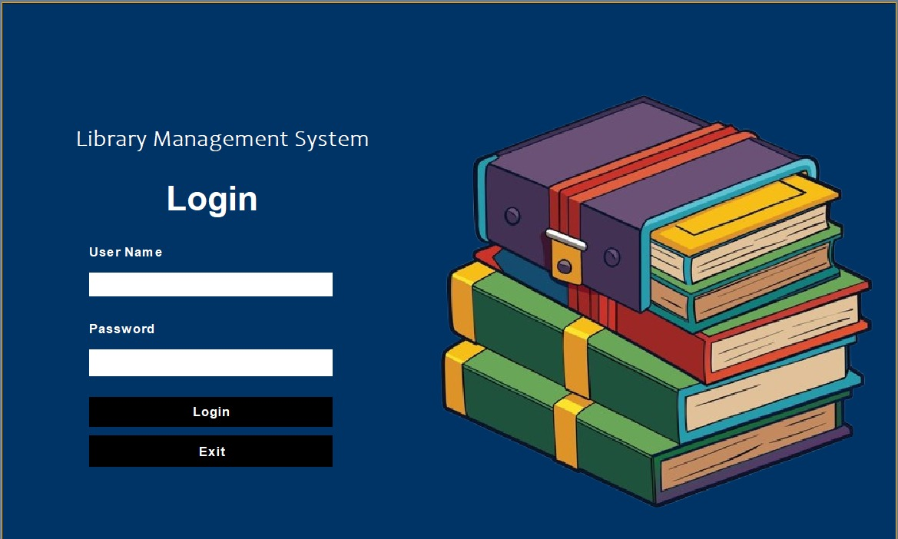

# 📚 Library Management System (Java - MVC)

A simple and efficient **Library Management System** built using **Java** and designed with the **MVC (Model-View-Controller)** architectural pattern. This system allows users to manage books, members, and borrow/return transactions with a clean separation of concerns between logic, interface, and data.

---

## 📷 Screenshots

### 🔐 Login Page

### 🏠 Home Page

---

## 🚀 Features

- Add, update, and delete books
- Register and manage members
- Issue and return books
- View available and borrowed books
- MVC Architecture for scalability and maintainability

---

## 🧱 Tech Stack

- **Java** (Core Java SE)
- **Swing** (GUI – View)
- **JDBC** (Database Connectivity – Model)
- **MVC Architecture** (Code Structure)
- **MySQL / SQLite** (for backend database)

---

## 📌 MVC Explanation

- **Model** → Interacts with the database (Book, Member, Transaction)
- **View** → Java Swing GUI forms
- **Controller** → Handles logic between the model and view

---

## ❤️ Contributions

- Pull requests are welcome. For major changes, please open an issue first to discuss what you would like to change.
